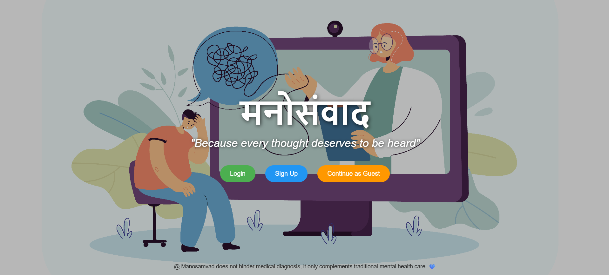
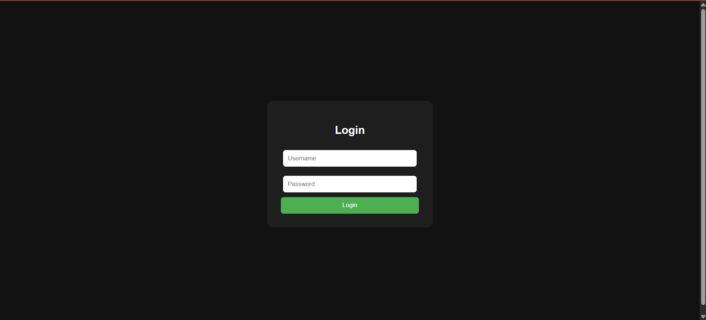
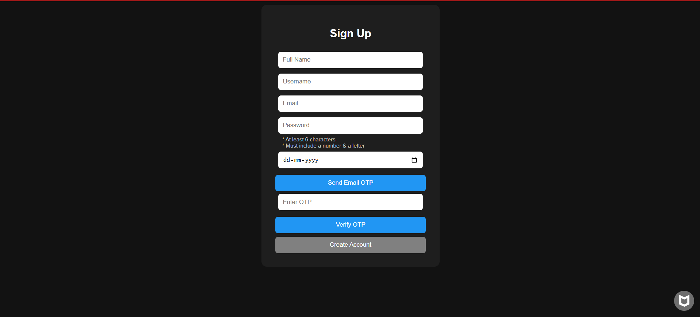
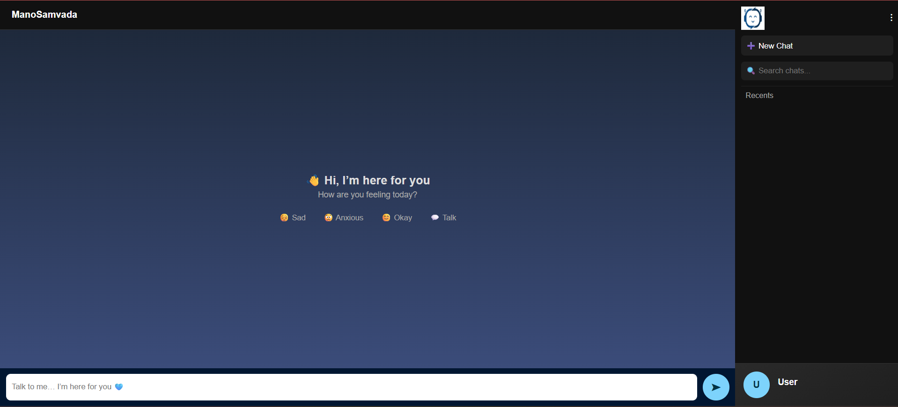
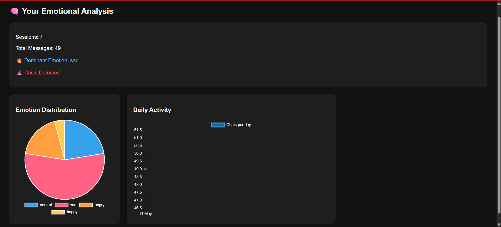
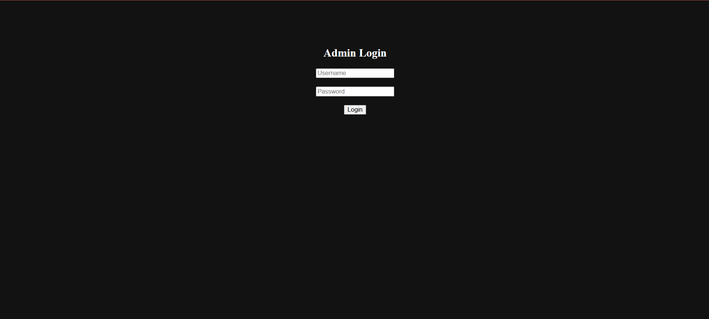
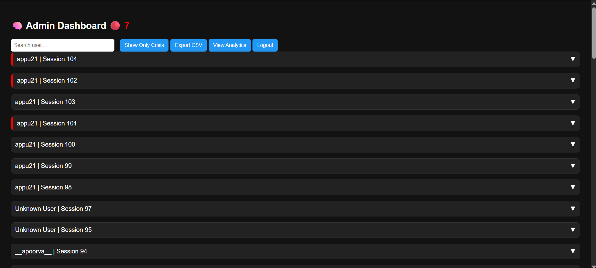
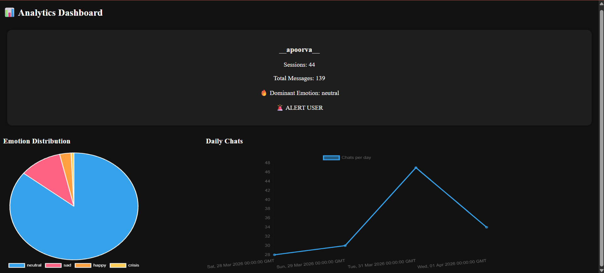

# ManoSamvada

AI-powered mental wellness chatbot with emotion detection, crisis support, session-based conversations, and a complete admin analytics dashboard.

## Live Demo

### User Portal
https://manosamvada.onrender.com

### Admin Portal
https://manosamvada.onrender.com/admin/login

## Features

- User authentication (Signup/Login)
- Password show/hide toggle
- Enter-key login support
- Guest mode for anonymous users
- AI chatbot conversations using Groq Llama API
- Real-time emotion detection
- Crisis detection and support prompts
- Session-based chat history
- Searchable chat history
- Edit previous user messages and continue conversation
- User emotional analytics dashboard
- Emotion distribution charts
- Daily chat activity tracking
- Emotion-based support suggestions
- Admin login
- Admin dashboard
- Admin user search
- Admin analytics for individual users
- Crisis monitoring
- CSV export with filters:
  - All chats
  - Specific user
  - Only crisis chats
  - User + crisis only
- Crisis keyword management

## Tech Stack

- Flask
- PostgreSQL
- HTML
- CSS
- JavaScript
- Chart.js
- Groq Llama API
- Python
- Render

## Folder Structure

```bash
ManoSamvada/
│
├── routes/
├── services/
├── templates/
├── static/
│
├── app.py
├── requirements.txt
└── README.md
```

## Setup

Install dependencies:

```bash
pip install -r requirements.txt
```

Run project:

```bash
python app.py
```

## Future Improvements

- Better multilingual emotional understanding
- Fuzzy crisis detection
- Therapist contact integration
- Improved AI personalization
- Email alerts for crisis cases
- More advanced analytics and emotion trends

## Application Screenshots

### Landing Page


### User Login


### User Signup


### Chat Interface


### User Emotional Analytics


### Admin Login


### Admin Dashboard


### Admin Analytics


## Purpose

ManoSamvada is designed to create a safe space where users can talk freely, understand emotional patterns over time, and receive support when needed.

It combines:

- AI conversations
- emotion awareness
- crisis support
- analytics

into one mental wellness platform.

**Because every thought deserves to be heard.**
